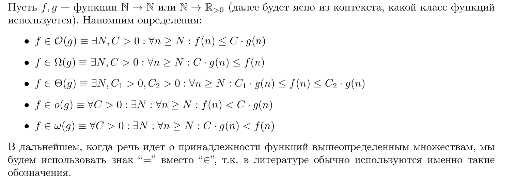

= Алгоритмы: NP-полнота
:stem:

Понятие сложности алгоритмов. Классы P и NP. Полиномиальная сводимость задач. Примеры NP-полных задач. Приближенные алгоритмы. Методы решения задач о выполнимости, об удовлетворении ограничений. Эволюционные алгоритмы.

== Понятие сложности алгоритмов

=== О-символика 
Будем говорить, что функция f растёт не быстрее g и обозначать f (n) = O(g(n)) или f ⪯ g, если существует такая константа c > 0, что
f (n) ≤ c · g(n) для всех натуральных n.

== Классы P и NP

В NP задачах надо найти объект с некоторыми свойствами среди экспоненциально большого множества кандидатов –– но для них никто не знает, как избежать перебора: самые быстрые известные алгоритмы для таких задач
имеют экспоненциальное время работы.

== Полиномиальная сводимость задач

== Примеры NP-полных задач

=== Задача выполнимости (Satisfiability, SAT)

Применение: тестирование микросхем, анализ изображений

Вход: булева формула в КНФ

== Приближенные алгоритмы

== Методы решения задач о выполнимости, об удовлетворении ограничений

== Эволюционные алгоритмы.
