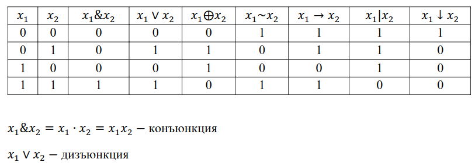
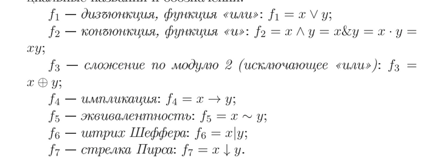
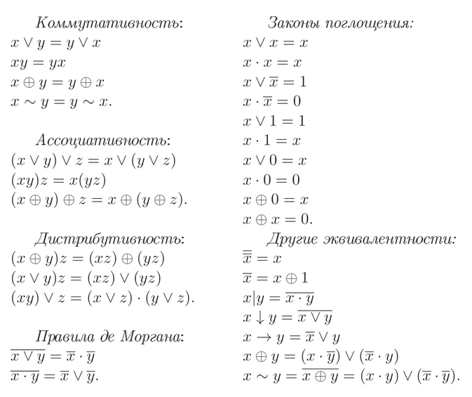
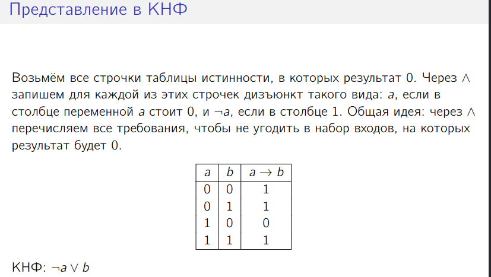
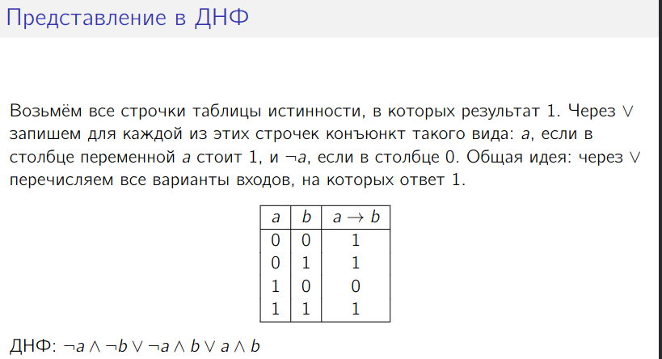

=  Булевы функции, КНФ, ДНФ

https://m.cs.msu.ru/s/6JnNMf5AXwYT7JF?path=%2F2021-%D0%BB%D0%B5%D0%BA%D1%86%D0%B8%D1%8F%203-%D0%94%D0%9D%D0%A4%2C%20%D0%9A%D0%9D%D0%A4%2C%20%D0%BF%D0%BE%D0%BB%D0%B8%D0%BD%D0%BE%D0%BC%D1%8B[Лекции МГУ]

:stem: latexmath

Функции  stem:[f : Е^n_2 \to Е_2], где stem:[Е_2 = \{0,1\}], называются функциями алгебры логики, или #булевыми функциями# от n переменных. Множество
булевых функций от n переменных обозначим stem:[P_n, P_n = \{ f | f : Е^n_2 \to Е_2\}].
Булеву функцию от n переменных можно задать таблицей истинности. 

Если число переменных равно n, то в таблице истинности имеется stem:[2^n] строк (булевых векторов), соответствующих всем различным комбинациям значений переменных. 

На каждом векторе булева функция принимает значение 0 или 1. Следовательно, существует stem:[2^{2^n}] различных столбцов, каждый из которых определяет булеву функцию от n переменных. 

 Чтобы описать одну функцию, нужно задать значения для x = 2^n входов. Всего комбинаций таких значений 2^x.

stem:[|P_n| = 2^{2^n}]

Булева функция stem:[f \in P_n] #существенно зависит#, от переменной stem:[x_i], если существует
такой набор значений stem:[a_1 ,... , a_{j - i},  a_{i +1}, ..., a_n], что stem:[f(a_1 ,... , a_{i - i}, 0, a_{i +1},..., a_n) \neq f(a_1 ,... , a_{i - i}, 1, a_{i +1},..., a_n) ]
В этом случае stem:[x_i] называют существенной переменной, в противном случае --- несущественной (фиктивной).

== Система связок 
Конъюнкция, дизъюнкция и отрицания образуют полную систему связок.

== КНФ
Дизъюнктом называется дизъюнкция литер. Говорят, что формула находится в конъюнктивной нормальной форме, если
она является конъюнкцией дизъюнктов. Также такая формула называется
конъюнктивной нормальной формой (сокращённо  КНФ).

Полезна, когда говорим о выполнимости формулы. 

Формула тавтологична, если её КНФ не содержит нетривиальных дизъюнктов.

== ДНФ

Конъюнктом называется конъюнкция литер. Гово-
рят, что формула находится в дизъюнктивной нормальной форме, если
она является дизъюнкцией конъюнктов. Также такая формула называется
дизъюнктивной нормальной формой (сокращённо  ДНФ). 

Формула #выполнима#, если её ДНФ содержит хотя бы один нетривиальный конъюнкт.