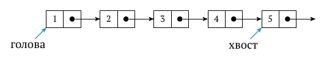
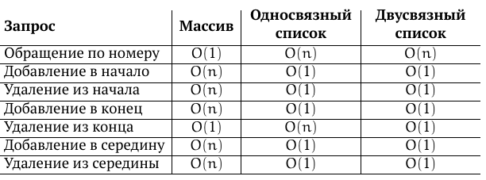

= Структуры данных.
:stem:

Линейные (списки, очереди, деки, вектора). Очереди с приоритетами. Деревья поиска.

Структура данных -- способ организации данных в памяти для эффективной работы с ними.

== Линейные

=== Вектор footnote:[https://habr.com/ru/articles/232009/]
Вектор (он же одномерный массив) — упорядоченный набор элементов с произвольным доступом по числовому индексу. Непрерывная область памяти, при переполнении нужно реалоцировать (мильтипликативно или аддитивно).

Обычно вектор (как низкоуровневая структура) будет представлять из себя дескриптор, содержащий различную информацию, неотделимую от самой структуры (разумнее всего держать там только размер вектора) и указатель на первый элемент.

=== Список 
В отличие от массива, где все данные хранятся в непрерывной области памяти, элементы списка могут быть разбросаны по памяти произвольным образом. Выделяют два основных вида списков: односвязный и двусвязный.

==== Односвязный 
Каждый элемент списка хранится в отдельной структуре -- узле -- структуре с двумя полями:

* элемент
* указатель на следующий узел

Задается парой указателей -- на голову и хвост.

==== Двусвязный 
В узле хранится ссылка на предыдущий элемент. 

Абстрактный тип данных (АТД) — это математическое описание структуры данных в терминах реализуемых ей запросов (как интерфейс, структура данных -- его реализация).

=== Очередь
• enqueue(x) — добавить элемент x в очередь,
• dequeue() — извлечь элемент из очереди.

Реализует концепцию FIFO

Реализация 

* на списке
* на массиве (кольцевой буфер)
* на двух стеках 

 Добавляем в s1. при его переполнении или запросе на получение -- перекладываем все элементы в s2. Извлекаем из s2. Амортизированное время также линейно (не больше двух push\pop на каждый элемент)

=== Дек
Двухсторонняя очередь 

* на двусвязном списке
* на массиве (кольцевой буфер)

== Очередь с приоритетами footnote:[https://neerc.ifmo.ru/wiki/index.php?title=Приоритетные_очереди]
Приоритетная очередь (англ. priority queue) — это абстрактная структура данных, где у каждого элемента есть значение и приоритет. Элемент с более высоким приоритетом находится перед элементом с более низким приоритетом. Если у элементов одинаковые приоритеты, они располагаются в зависимости от своей позиции в очереди. Обычно приоритетные очереди реализуются с помощью куч (англ. heap).

Операции

* findMin или findMax — поиск элемента с наибольшим приоритетом,
* insert или push — вставка нового элемента,
* extractMin или extractMax — извлечь элемент с наибольшим приоритетом,
* deleteMin или deleteMax — удалить элемент с наибольшим приоритетом,
* increaseKey или decreaseKey — обновить значение элемента,
* merge — объединение двух приоритетных очередей, сохраняя оригинальные очереди,
* meld — объединение двух приоритетных очередей, разрушая оригинальные очереди,
* split — разбить приоритную очередь на две части.

=== Реализации
==== Наивная
В качестве наивной реализации мы можем взять обычный список и при добавлении нового элемента класть его в конец, а при запросе элемента с максимальным приоритетом проходить по всему списку. Тогда операция insert
 будет выполняться за O(1)
, а extractMin
 или extractMax
 за O(n)
.

==== Обычная
Для лучшей производительности приоритетные очереди реализуют с помощью куч, что позволяет выполнять операции вставки и удаления за O(logn)
. Использование специальных куч, таких как Фибоначчиева куча и спаренная куча, позволяет еще больше улучшить асимптотику некоторый операций.

== Деревья поискапоиска footnote:[https://neerc.ifmo.ru/wiki/index.php?title=Дерево_поиска,_наивная_реализация]
Бинарное дерево поиска (англ. binary search tree, BST) — структура данных для работы с упорядоченными множествами.
Бинарное дерево поиска обладает следующим свойством: если x
 — узел бинарного дерева с ключом k
, то все узлы в левом поддереве должны иметь ключи, меньшие k
, а в правом поддереве большие k
.

